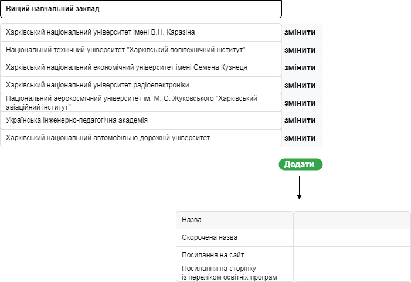
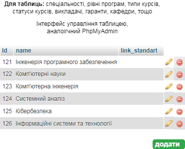

# Certification
**Загальний опис проекта:** інформаційна система, яка дозволяє керувати процесом сертифікації ІТ-дисциплін в вишах Харкова, за рахунок обліку поточного стану сібусів освітніх курсів в вишах в Харкові, а також можливості оцінювати, узагальнювати існуючі матеріали та спрямовано залучати викладачів до процесу сертифікації дисциплін та подальшого їх покращення.

## Технології, що використовуються
### FrontEnd
HTML+CSS (Bootstrap), JS (отримання даних).

### BackEnd
PHP (стабільна робота, немає потреби компілювати мікросервіси), MySQL.

## Технічне завдання
### MockUps.
* **Перелік університетів**  
  

* **Перелік освітніх програм**  
  

* **Перелік курсів**  
  

* **Інші таблиці**   
  

### Endpoints
#### Довідники
Ендпоінти, які описують сталі дані, для яких достатньо зробити CRUD-функціонал.
Довідники модуть бути **непов'язані** - тобто в них є тільки первинні поля і щодного посилання на інші таблиці. Та **пов'язані** - ті, які
використовують дані з інших довідників через зовнішній ключ.
  
Для непов'язаних довідників - реалізуємо функціонал виведення всіх записів, а також вибірки за id.  
Для пов'язаних довідників - додаємо вивід записів, що відповідають значенню певного зовнішнього ключа.

##### Університети:
Таблиця зі всіма університетами, що приймають участь в проекті.

**/universities:**  

##### Спеціальність
Перелік всіх спеціальностей, що беруть в проекті (12 спеціальність: 121,122,123,124,125,126)

**/specialty**  

##### Рівень освітньої програми
Рівень освітньої програми - перший - бакалаврський, другий - магістерський

**/programs_levels**  

##### Типи курсів
Це групи курсів, нариклад тип курса "Основи програмування" буде об'єднувати всі курси, що йдуть першими у вивченні певної мови. Проте назви сами курсів можуть дуже сильно відрізнятися.
**/course_types**

##### Навчальні матеріали
Методички, підручники, лекції, відео, що мають відношення до сфери проекту.

**/materials**

#### Пов'язані довідники
##### Випускаючі кафедри вишів
Перелік кафедр, що мають освітні програми, що приймають участь в проекті.

**/schools**  

##### Освітні програми
Перелік всіх освітніх програм, що беруть в проекті. Вони відносяться до кафедри, та університета.

**/programs:specialty_id|university_id|level|**  
  

##### Курси
Курси (Назва, освітня програма, автор-викладач, тип курсу), які є складової освітньої програми, що бере участь в проекті.

**/courses:type_id|program_id|teacher_id**
  
##### Викладачі
Викладачі, що ведуть курси за освітніми програмами, що беруть участь в проекті

**/teachers**  

#### Таблиці зв'язування
Таблиці, що реалізують зв'язок багато до багатьох  

##### Матеріал до курсу

**/material2course**
  
  
  

  
/course_types:type_id  
  
/course_statuses  
